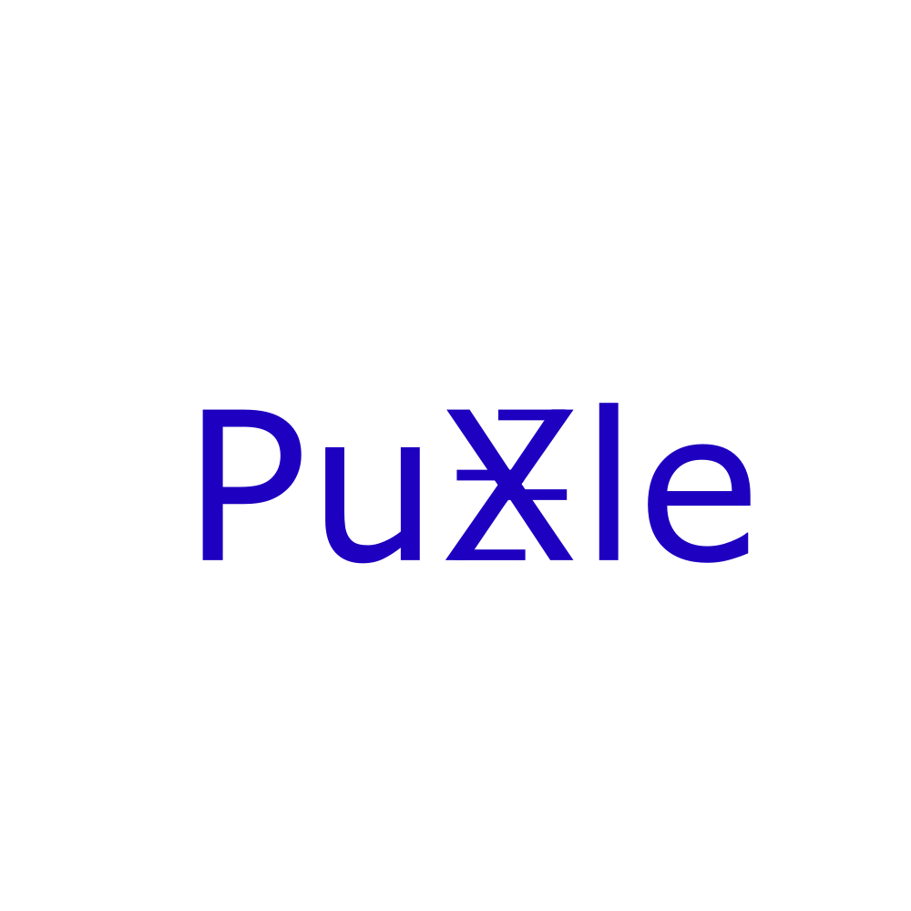

<div align="center">
  
</div>

# PuXle: Parallelized Puzzles with JAX

[](https://opensource.org/licenses/MIT)

**PuXle** is a high-performance library for parallelized puzzle environments built on JAX. It provides a collection of classic puzzles optimized for AI research, reinforcement learning, and search algorithms.

## 🚀 Features

- **High Performance**: JAX-powered parallelization for lightning-fast puzzle solving
- **Diverse Puzzles**: 11+ classic puzzles including Rubik's Cube, Sokoban, Sliding Puzzle, and more
- **AI Research Ready**: Perfect for reinforcement learning, search algorithms, and AI research
- **Batch Processing**: Efficient batch operations for training and evaluation
- **Extensible**: Easy-to-extend base classes for creating new puzzle environments
- **GPU Acceleration**: Full GPU support through JAX

## 🌐 Xtructure Ecosystem Integration

**PuXle** is built as a specialized component within the [Xtructure](https://github.com/tinker495/Xtructure) ecosystem, leveraging Xtructure's powerful framework for structured data management in JAX environments.

### 🔗 What is Xtructure?

Xtructure is a foundational library that provides:
- **Structured State Management**: Type-safe dataclass definitions compatible with JAX transformations
- **Memory Optimization**: Efficient bit-packing and unpacking for memory-constrained environments
- **Batch Operations**: Seamless conversion between single and batched data structures
- **JAX Integration**: Full compatibility with `jit`, `vmap`, `grad`, and other JAX transformations

### 🎯 PuXle's Role in the Ecosystem

PuXle serves as a **high-performance puzzle environment library** that demonstrates and extends Xtructure's capabilities:

1. **Efficient State Representation**: Each puzzle state uses Xtructure's `FieldDescriptor` and `state_dataclass` decorators to create memory-efficient, JAX-compatible data structures.

2. **Bit-Level Optimization**: Puzzle states are automatically packed into minimal bit representations (e.g., Rubik's Cube faces use 4-bit encoding), significantly reducing memory usage for large-scale parallel operations.

3. **Seamless Batching**: Leverages Xtructure's structured type system to enable efficient vectorized operations across thousands of puzzle instances simultaneously.

4. **Research Infrastructure**: Provides a standardized, high-performance foundation for AI research in puzzle domains, search algorithms, and reinforcement learning.

5. **Complex State Management & Hashing**: Xtructure's advanced dataclass system enables automatic state hashing and comparison for heterogeneous puzzle states, making it ideal for search algorithms like A*.

### 🔍 Advanced State Management with Xtructure

One of Xtructure's most powerful features is its ability to handle **complex, heterogeneous state definitions** with automatic hashing and equality comparison. This is crucial for implementing sophisticated search algorithms:

#### Multi-Component State Structures
```python
# Sokoban: 2D board with player, boxes, and targets
@state_dataclass
class SokobanState:
    board: FieldDescriptor[jnp.uint8, (packed_shape,)]  # 2-bit packed board
    
# TSP: Visited cities mask + current position
@state_dataclass  
class TSPState:
    mask: FieldDescriptor[jnp.uint8, (packed_mask_shape,)]  # 1-bit packed mask
    point: FieldDescriptor[jnp.uint16]  # Current city index
    
# Each state automatically gets proper hashing and equality
```

#### Automatic State Hashing for Search Algorithms
Xtructure automatically generates hash functions for complex states, enabling:
- **Visited set management** in BFS/DFS
- **Priority queue operations** in A* search
- **Memoization** in dynamic programming
- **Duplicate detection** in search trees

```python
# States can be directly used in hash-based data structures
visited_states = set()
priority_queue = [(heuristic(state), state) for state in initial_states]

# Xtructure handles the complexity of hashing multi-field states
if current_state not in visited_states:
    visited_states.add(current_state)
    for neighbor in get_neighbors(current_state):
        heapq.heappush(priority_queue, (f_score(neighbor), neighbor))
```

#### Enabling Advanced Search Algorithms
This robust state management foundation makes PuXle ideal for implementing:

1. **JAxtar-style A* Search**: Efficient pathfinding with automatic state hashing
2. **Monte Carlo Tree Search (MCTS)**: Fast state comparison and tree traversal
3. **Beam Search**: Parallel state exploration with memory-efficient storage
4. **Bidirectional Search**: Forward/backward state space exploration

### 🚀 Real-World Applications

The combination of PuXle's puzzle environments and Xtructure's state management enables:

- **Neural Search Algorithms**: Train neural networks to guide search (like in JAxtar)
- **Parallel Search**: Vectorized search across multiple puzzle instances
- **Hybrid Solvers**: Combine classical search with learned heuristics
- **Research Benchmarks**: Standardized evaluation for AI search methods

### 🏗️ Technical Integration

```python
# Example: How PuXle leverages Xtructure for state management
from xtructure import FieldDescriptor, xtructure_dataclass
from puxle.utils.util import to_uint8, from_uint8

@state_dataclass
class RubiksCubeState:
    faces: FieldDescriptor[jnp.uint8, (packed_shape,)]
    
    @property
    def packed(self):
        # Efficient 4-bit packing using Xtructure utilities
        return State(faces=to_uint8(self.faces, 4))
    
    @property
    def unpacked(self):
        # Seamless unpacking for computations
        return State(faces=from_uint8(self.faces, raw_shape, 4))
    
    # Automatic hashing and equality comparison
    # No need to implement __hash__ or __eq__ manually!

# Usage in search algorithms
def a_star_search(initial_state, goal_state):
    open_set = {initial_state}  # Automatic hashing works
    closed_set = set()
    
    while open_set:
        current = min(open_set, key=lambda s: f_score(s))
        if current == goal_state:  # Automatic equality comparison
            return reconstruct_path(current)
        
        open_set.remove(current)
        closed_set.add(current)
        
        for neighbor in get_neighbors(current):
            if neighbor in closed_set:  # Hash-based lookup
                continue
            open_set.add(neighbor)
```

This integration makes PuXle not just a puzzle library, but a **complete framework for developing advanced search algorithms** that can handle complex, structured states efficiently at scale.

## 📦 Installation

### Basic Installation
```bash
pip install puxle
pip install git+https://github.com/tinker495/PuXle.git # recommended
```

## 🎯 Quick Start

```python
import jax
import jax.numpy as jnp
from puxle import RubiksCube, SlidePuzzle, Sokoban

# Initialize a puzzle
puzzle = RubiksCube()
key = jax.random.PRNGKey(42)

# Get initial state and solve configuration
solve_config, initial_state = puzzle.get_inits(key)

# Get available actions
neighbors, costs = puzzle.get_neighbours(solve_config, initial_state)

# Check if solved
is_solved = puzzle.is_solved(solve_config, initial_state)
print(f"Initial state solved: {is_solved}")

# Visualize the puzzle (if image parser is available)
try:
    image = puzzle.State.img(initial_state)
    print(f"State visualization shape: {image.shape}")
except:
    print("Image visualization not available for this puzzle")
```

## 🧩 Available Puzzles

| Puzzle | Description | Difficulty |
|--------|-------------|------------|
| **RubiksCube** | Classic 3×3×3 Rubik's Cube | Hard |
| **SlidePuzzle** | N×N sliding tile puzzle | Medium |
| **Sokoban** | Box-pushing warehouse puzzle | Hard |
| **TowerOfHanoi** | Classic disk-moving puzzle | Medium |
| **LightsOut** | Toggle lights to turn all off | Medium |
| **Maze** | Navigate through a maze | Easy-Medium |
| **TSP** | Traveling Salesman Problem | Hard |
| **PancakeSorting** | Sort pancakes by flipping | Medium |
| **TopSpin** | Circular sliding puzzle | Medium |
| **DotKnot** | Untangle knots puzzle | Medium |

## 📚 Advanced Usage

### Batch Processing
```python
# Process multiple puzzle instances simultaneously
batch_size = 1000
keys = jax.random.split(jax.random.PRNGKey(0), batch_size)

# Generate batch of initial states
solve_configs = jax.vmap(lambda k: puzzle.get_solve_config(k))(keys)
initial_states = jax.vmap(lambda sc, k: puzzle.get_initial_state(sc, k))(solve_configs, keys)

# Batch solve checking
solved_states = puzzle.batched_is_solved(solve_configs, initial_states)
print(f"Solved states in batch: {jnp.sum(solved_states)}")
```

### Custom Puzzle Creation
```python
from puxle import Puzzle, state_dataclass
from puxle.puzzle_state import FieldDescriptor

class CustomPuzzle(Puzzle):
    action_size = 4  # Number of possible actions
    
    def define_state_class(self):
        @state_dataclass
        class State:
            position: FieldDescriptor[jnp.ndarray]  # Current position
            
        return State
    
    def get_solve_config(self, key=None, data=None):
        # Define target configuration
        return self.SolveConfig(TargetState=self.State(position=jnp.array([0, 0])))
    
    def get_initial_state(self, solve_config, key=None, data=None):
        # Define initial state
        return self.State(position=jnp.array([5, 5]))
    
    def get_neighbours(self, solve_config, state, filled=True):
        # Define valid moves and their costs
        # Return (next_states, costs) 
        pass
    
    def is_solved(self, solve_config, state):
        # Check if current state matches target
        return jnp.array_equal(state.position, solve_config.TargetState.position)
```

## 🔧 API Reference

### Core Classes

- **`Puzzle`**: Base class for all puzzles
- **`PuzzleState`**: Base class for puzzle states
- **`SolveConfig`**: Configuration class for puzzle objectives

### Key Methods

- **`get_inits(key)`**: Get initial state and solve configuration
- **`get_neighbours(solve_config, state)`**: Get valid next states and costs
- **`is_solved(solve_config, state)`**: Check if puzzle is solved
- **`batched_*`**: Batch versions of core methods for parallel processing

## 🧪 Testing

Run the test suite:
```bash
pytest tests/
```

Run with coverage:
```bash
pytest --cov=puxle tests/
```

## 📄 License

This project is licensed under the MIT License - see the [LICENSE](LICENSE) file for details.
