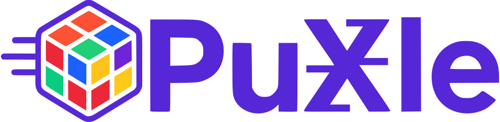

<div align="center">
  
</div>

# **PuXle**: **P**lanning **u**sing ja**X**-based **l**earning **e**nvironments

[](https://opensource.org/licenses/MIT)
[](https://tinker495.github.io/PuXle/)

**PuXle** is a high-performance library for parallelized planning and puzzle environments built on JAX. It provides a comprehensive collection of classic puzzles and PDDL-based planning domains optimized for AI research, reinforcement learning, and search algorithms. PuXle leverages [Xtructure](https://github.com/tinker495/Xtructure.git) as a backend for JAX-optimized data structures, offering advantages such as efficient batched operations, GPU-accelerated priority queues and hash tables for faster planning and puzzle solving in AI research. PuXle serves as the planning and puzzle implementation backend for [JAxtar](https://github.com/tinker495/JAxtar), enabling JAX-native parallelizable A* and Q* solvers for neural heuristic search research.

## 🚀 Features

- **High Performance**: JAX-powered parallelization for lightning-fast planning and puzzle solving
- **PDDL Support**: Full STRIPS subset support with automatic grounding and JAX-optimized state representation
- **cayleypy Bridge**: Adapter that consumes any [cayleypy](https://github.com/cayleypy/cayleypy) `CayleyGraphDef` (permutation or matrix groups, ~30 ready-made graph families) as a JAX-native `Puzzle` — no PyTorch in the import chain
- **Optimized Data Structures**: Powered by Xtructure for efficient batched operations, GPU-accelerated priority queues, and hash tables
- **Diverse Environments**: 11+ classic puzzles + PDDL domains for comprehensive planning research
- **AI Research Ready**: Perfect for reinforcement learning, search algorithms, and AI research
- **Batch Processing**: Efficient batch operations for training and evaluation
- **Extensible**: Easy-to-extend base classes for creating new puzzle and planning environments
- **GPU Acceleration**: Full GPU support through JAX

## 📚 Documentation

Full API documentation is automatically built and deployed to **[GitHub Pages](https://tinker495.github.io/PuXle/)** on every push to `main`.

- **[API Reference](https://tinker495.github.io/PuXle/api/index.html)** — All modules, classes, and functions
- **Bitpacked runtime states (xtructure)**: [`docs/tutorials/xtructure_bitpacking.md`](docs/tutorials/xtructure_bitpacking.md)
- **cayleypy bridge — Cayley/Schreier graphs as PuXle puzzles**: [`docs/tutorials/cayley_bridge.md`](docs/tutorials/cayley_bridge.md)

## 📦 Installation

Install from PyPI (stable release) or GitHub (latest `main`):

```bash
pip install puxle
pip install "puxle @ git+https://github.com/tinker495/PuXle.git"
```

Optional extras (pyproject-managed):

```bash
pip install "puxle[dev]"
pip install "puxle[docs]"
pip install "puxle[visualization]"
pip install "puxle[cuda]"
pip install "puxle[cayley]"   # adds cayleypy as a dependency for the Cayley/Schreier bridge

# Combine extras
pip install "puxle[dev,docs,visualization,cuda,cayley]"
# GitHub + extras
pip install "puxle[dev,docs,visualization,cuda,cayley] @ git+https://github.com/tinker495/PuXle.git"
```

## 🎯 Quick Start

### Classic Puzzles
```python
import jax
import jax.numpy as jnp
from puxle import RubiksCube, SlidePuzzle, Sokoban

# Initialize a puzzle
puzzle = RubiksCube()
key = jax.random.PRNGKey(42)

# Get initial state and solve configuration
solve_config, initial_state = puzzle.get_inits(key)

# Get available actions
neighbors, costs = puzzle.get_neighbours(solve_config, initial_state)

# Check if solved
is_solved = puzzle.is_solved(solve_config, initial_state)
print(f"Initial state solved: {is_solved}")

# Visualize the puzzle (if image parser is available)
try:
    image = puzzle.State.img(initial_state)
    print(f"State visualization shape: {image.shape}")
except:
    print("Image visualization not available for this puzzle")
```

### PDDL Planning Domains
```python
import jax
import jax.numpy as jnp
from puxle import PDDL

# Initialize PDDL planning domain
pddl_env = PDDL(domain="path/to/domain.pddl", problem="path/to/problem.pddl")

# Get initial state and goal configuration
solve_config, initial_state = pddl_env.get_inits(jax.random.PRNGKey(0))

# Get all applicable actions and their effects
neighbors, costs = pddl_env.get_neighbours(solve_config, initial_state)

# Check if goal is satisfied
is_solved = pddl_env.is_solved(solve_config, initial_state)
print(f"Goal satisfied: {is_solved}")

# Get string representation of current state
state_str = str(initial_state)
print(f"Current state: {state_str}")

# Get action names
for i, cost in enumerate(costs):
    if cost < jnp.inf:  # Applicable action
        action_name = pddl_env.action_to_string(i)
        print(f"Applicable action {i}: {action_name}")
```

## 🧩 Available Environments

### Classic Puzzles
| Puzzle | Description | Difficulty |
|--------|-------------|------------|
| **RubiksCube** | Classic 3×3×3 Rubik's Cube | Hard |
| **SlidePuzzle** | N×N sliding tile puzzle | Medium |
| **Sokoban** | Box-pushing warehouse puzzle | Hard |
| **TowerOfHanoi** | Classic disk-moving puzzle | Medium |
| **LightsOut** | Toggle lights to turn all off | Medium |
| **Maze** | Navigate through a maze | Easy-Medium |
| **TSP** | Traveling Salesman Problem | Hard |
| **PancakeSorting** | Sort pancakes by flipping | Medium |
| **TopSpin** | Circular sliding puzzle | Medium |
| **DotKnot** | Untangle knots puzzle | Medium |
| **CayleyPuzzle** | Adapter wrapping any [cayleypy](https://github.com/cayleypy/cayleypy) Cayley/Schreier graph as a JAX-native puzzle (permutation or matrix groups) | Variable |

### Cayley / Schreier Graphs via cayleypy

`CayleyPuzzle` is a single-class adapter that turns any `cayleypy.CayleyGraphDef` (~30 permutation families like *pancake*, *LRX*, *top_spin*, *coxeter*, plus matrix groups like *heisenberg*, *special_linear_\**, plus the *mini_pyramorphix* / *pyraminx* / *globe_puzzle* Schreier graphs) into a JAX-native `Puzzle`. The bridge consumes `CayleyGraphDef` as **plain data** — no PyTorch in PuXle/JAxtar's import chain. See the dedicated tutorial below.

### PDDL Planning Domains
**⚠️ Experimental Feature**: PDDL support in PuXle is currently experimental and under active development. While we strive for full STRIPS subset compliance, some edge cases may not be fully supported yet.

PuXle supports the full STRIPS subset of PDDL:
- **Conjunctive preconditions** (positive + negative literals)
- **Add/delete effects** (no conditional effects)
- **Conjunctive positive goals**
- **Typed objects**
- **Equality / inequality constraints in preconditions**
- **Automatic grounding** of predicates and actions
- **JAX-optimized state representation** with bit-packed atoms

Common PDDL domains include:
- **Blocks World**: Stacking and unstacking blocks
- **Gripper**: Robot arm manipulation
- **Logistics**: Package delivery planning
- **Rovers**: Mars rover exploration
- **Satellite**: Satellite observation planning
- **Custom domains**: Any STRIPS-compliant PDDL domain

## 📚 Advanced Usage

### Batch Processing
```python
# Process multiple puzzle instances simultaneously
batch_size = 1000
keys = jax.random.split(jax.random.PRNGKey(0), batch_size)

# Generate batch of initial states
solve_configs = jax.vmap(lambda k: puzzle.get_solve_config(k))(keys)
initial_states = jax.vmap(lambda sc, k: puzzle.get_initial_state(sc, k))(solve_configs, keys)

# Batch solve checking with multiple solve configs
solved_states = puzzle.batched_is_solved(solve_configs, initial_states, multi_solve_config=True)
print(f"Solved states in batch: {jnp.sum(solved_states)}")

# Alternative: Use single solve config for all states
single_solve_config = puzzle.get_solve_config(jax.random.PRNGKey(42))
solved_states_single = puzzle.batched_is_solved(single_solve_config, initial_states, multi_solve_config=False)
print(f"Solved states with single config: {jnp.sum(solved_states_single)}")
```

### PDDL Advanced Features
```python
# Access grounded atoms and actions
print(f"Number of grounded atoms: {pddl_env.num_atoms}")
print(f"Number of grounded actions: {pddl_env.num_actions}")

# Get atom and action mappings
atom_str = "(on block1 block2)"
if atom_str in pddl_env.atom_to_idx:
    atom_idx = pddl_env.atom_to_idx[atom_str]
    print(f"Atom '{atom_str}' has index {atom_idx}")

# Check predicate truth values in a state
predicate_values = pddl_env.static_predicate_profile(initial_state, "on")
print(f"Truth values for 'on' predicate: {predicate_values}")

# Convert state to atom set for analysis
true_atoms = pddl_env.state_to_atom_set(initial_state)
print(f"True atoms in state: {true_atoms}")
```

### Custom Environment Creation
```python
import jax.numpy as jnp
from puxle import Puzzle, state_dataclass, FieldDescriptor


class CustomPuzzle(Puzzle):
    action_size = 4  # Number of possible actions

    def define_state_class(self):
        @state_dataclass
        class State:
            position: FieldDescriptor.scalar(dtype=jnp.int32, shape=(2,))  # Current position

        return State

    def get_solve_config(self, key=None, data=None):
        # Define target configuration
        return self.SolveConfig(TargetState=self.State(position=jnp.array([0, 0])))

    def get_initial_state(self, solve_config, key=None, data=None):
        # Define initial state
        return self.State(position=jnp.array([5, 5]))

    def get_neighbours(self, solve_config, state, filled=True):
        # Define valid moves: up, down, left, right
        moves = jnp.array([[0, 1], [0, -1], [-1, 0], [1, 0]])
        new_positions = state.position[None, :] + moves

        # Create next states
        next_states = jax.tree_util.tree_map(lambda x: jnp.repeat(x[None, :], 4, axis=0), state)
        next_states = next_states.replace(position=new_positions)

        # All moves have cost 1
        costs = jnp.ones(4)

        return next_states, costs

    def is_solved(self, solve_config, state):
        # Check if current state matches target
        return jnp.array_equal(state.position, solve_config.TargetState.position)

    def get_string_parser(self):
        # Required: Return function to convert state to string
        def string_parser(state):
            return f"Position: ({state.position[0]}, {state.position[1]})"

        return string_parser

    def get_img_parser(self):
        # Required: Return function to convert state to image array
        def img_parser(state):
            # Create a simple 10x10 grid visualization
            grid = jnp.zeros((10, 10, 3))
            x, y = state.position
            # Place a marker at current position (clamp to grid bounds)
            x = jnp.clip(x, 0, 9)
            y = jnp.clip(y, 0, 9)
            grid = grid.at[y, x].set(jnp.array([1.0, 0.0, 0.0]))  # Red dot
            return grid

        return img_parser
```

## 🔧 API Reference

### Core Classes

- **`Puzzle`**: Base class for all puzzles and planning environments
- **`PDDL`**: PDDL planning domain wrapper with STRIPS subset support
- **`PuzzleState`**: Base class for puzzle states
- **`SolveConfig`**: Configuration class for puzzle objectives

### Key Methods

- **`get_inits(key)`**: Get initial state and solve configuration
- **`get_neighbours(solve_config, state)`**: Get valid next states and costs
- **`is_solved(solve_config, state)`**: Check if puzzle/planning goal is satisfied
- **`batched_*`**: Batch versions of core methods for parallel processing

### PDDL-Specific Methods

- **`action_to_string(action_idx)`**: Get human-readable action name
- **`state_to_atom_set(state)`**: Convert state to set of true atoms
- **`static_predicate_profile(state, pred_name)`**: Get truth values for a predicate

## 🧪 Testing

Run the test suite:
```bash
pytest tests/
```

Run with coverage:
```bash
pytest --cov=puxle tests/
```

## 📄 License

This project is licensed under the MIT License - see the [LICENSE](LICENSE) file for details.

## 🔗 cayleypy Bridge

PuXle ships a JAX-native adapter that brings the full [cayleypy](https://github.com/cayleypy/cayleypy) catalog of Cayley/Schreier graphs into PuXle, **without dragging PyTorch into the JAX stack**. Two layers:

### 1. The adapter class — `CayleyPuzzle`

Wraps a `cayleypy.cayley_graph_def.CayleyGraphDef` (which itself is a frozen dataclass of `generators_permutations`, `generators_matrices`, `central_state`, and `name`) as a `Puzzle`. Supports both `PERMUTATION` and `MATRIX` generator types. Construction-time kernel switch — no runtime branching inside `get_actions`.

```python
from cayleypy.graphs_lib import PermutationGroups
from puxle import CayleyPuzzle

graph_def = PermutationGroups.pancake(7)
puzzle = CayleyPuzzle(graph_def, num_shuffle=10)
solve_config, initial_state = puzzle.get_inits(jax.random.PRNGKey(0))
neighbours, costs = puzzle.get_neighbours(solve_config, initial_state)
```

Or use the convenience factory that walks `PermutationGroups → MatrixGroups → Puzzles` (first-wins):

```python
puzzle = CayleyPuzzle.from_cayleypy_factory("top_spin", 8, k=4)
```

### 2. Auto-generated subclasses — pattern-based naming

For one-shot use as a no-arg `Puzzle` (e.g. registering into JAxtar's puzzle registry), import names of the form `Cayley<FactoryPascalCase>[_<arg>…]`:

```python
from puxle import (
    CayleyPancake7,            # PermutationGroups.pancake(7)
    CayleyLRX12,               # PermutationGroups.lrx(12)
    CayleyTopSpin8K4,          # PermutationGroups.top_spin(8, k=4)  (kwarg form)
    CayleyTopSpin8_4,          # PermutationGroups.top_spin(8, 4)    (positional)
    CayleyConsecutiveKCycles8_3,
    CayleyAllCycles6,
)
```

The class is generated lazily on first attribute access via a module-level `__getattr__`; subsequent lookups return the same object. New cayleypy factories require **zero PuXle code changes** — name the class and it works. List available factories:

```python
from puxle.puzzles.cayley_subclasses import list_available_factories, discover
print(list_available_factories())  # ['all_cycles', 'lrx', 'pancake', ...]
cls = discover("pancake", 9)        # build without name parsing
```

### Optional dependency

Install the cayleypy extra to enable the bridge:

```bash
pip install "puxle[cayley]"
```

The adapter module itself imports cleanly without cayleypy installed; construction raises `ImportError` naming `[cayley]`. See [`docs/tutorials/cayley_bridge.md`](docs/tutorials/cayley_bridge.md) for a longer walk-through of the adapter API, the auto-generated subclasses, and empirical JAxtar A\* benchmarks across the cayleypy catalog.

## See Also

- [Xtructure](https://github.com/tinker495/Xtructure): JAX-optimized data structures used as a backend for PuXle.
- [JAxtar](https://github.com/tinker495/JAxtar): JAX-native parallelizable A* and Q* solver that uses PuXle as its planning and puzzle implementation backend.
- [cayleypy](https://github.com/cayleypy/cayleypy): PyTorch library for very-large state-transition / Cayley graphs whose `CayleyGraphDef` catalog is consumed by the bridge above.

## 🤝 Contributing and Feedback

We welcome contributions, bug reports, and feature requests! Since the author is still learning about this research field, we particularly appreciate feedback and suggestions for improvements from the community. Please feel free to:

- Open issues for bugs or feature requests
- Submit pull requests with improvements
- Provide feedback on PDDL implementation or other features
- Share your research use cases and requirements

Your input helps make PuXle better for the entire AI research community!
